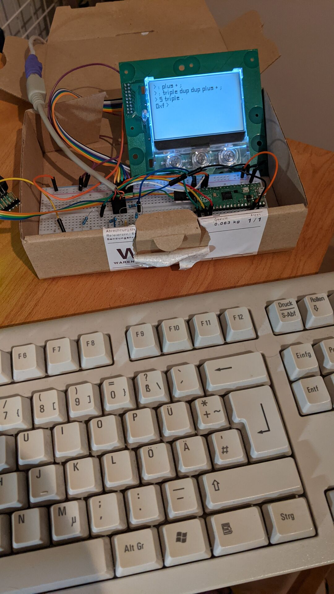

# Picoforth

An attempt to bootstrap a development environment directly on a Raspberry Pi Pico. This was heavily inspired by @NieDzejkob's
[miniforth](https://niedzejkob.p4.team/bootstrap/miniforth). This is work in progress.

## Progress
 * 2021-12-18: Much of the initial bootstrapping is done.
   New words can be defined. There's no persistence, yet.

## Hardware

 * A standard 128x64 monochrome LCD display found on ebay using an ST756 controller.
 * A PS/2 keyboard, directly wired to Pico GPIO using a simple resistor divider.
 * Optionally a second Pico running picoprobe for debugging / running directly out of vscode.

 ## Firmware

 The idea is similar to miniforth to bootstrap a minimal Forth enviroment and then start doing all further development directly on the machine. Currently, code is divided into two parts:

  * All the I/O is written in C and uses the Pico SDK. There's minimal code to run the keyboard and the display.
  * The PS/2 wire interface is "implemented" using Pico's PIO. In fact, the protocol is extremely simple, not much to do above what the "clocked input" example from pico-examples provides.
  * True to miniforth's efforts, the actual initial forth runtime is written directly in Assembler. There's no particularly good reason for that. This is rather an "educational inconvenience" than anything else.